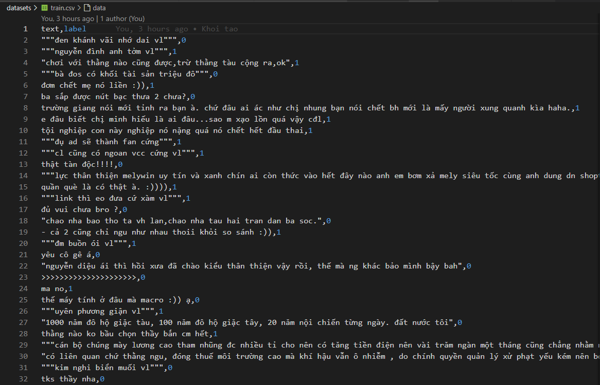

# Text Minning 

Sử dụng các phương pháp trích xuất đặc trưng và các thuật toán Machine Learning truyền thống

### Yêu cầu

* Python 3.8+
* Java 1.8+

### Cài đặt

* Thực hiện câu lệnh:

    `$ pip install -r requirements.txt` 

### Chuẩn bị dữ liệu

* Dữ liệu huấn luyện được tổ chức như sau:
    * 2 File "**train.csv**", "**test.csv**": được bao gồm các thông tin "**text**": nội dung của đoạn văn bản, "**label**": nhãn của văn bản. Với id2label = {0: "normal", 1: "malicious"}

